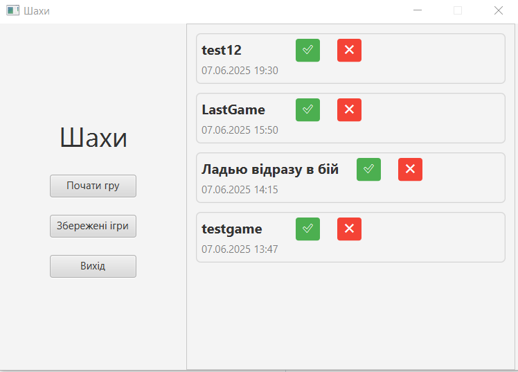
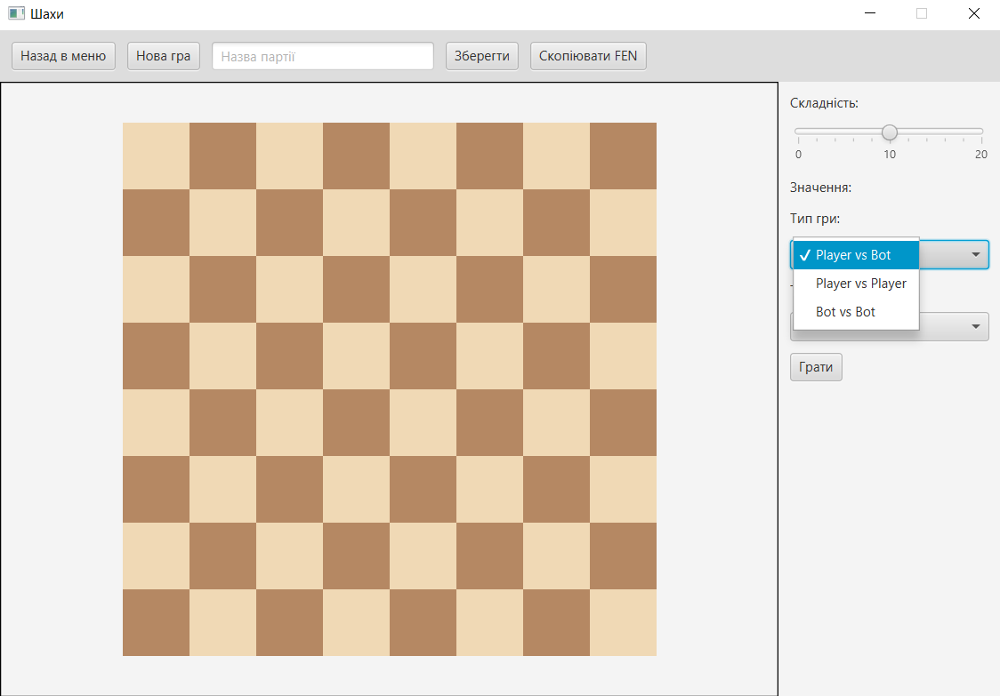
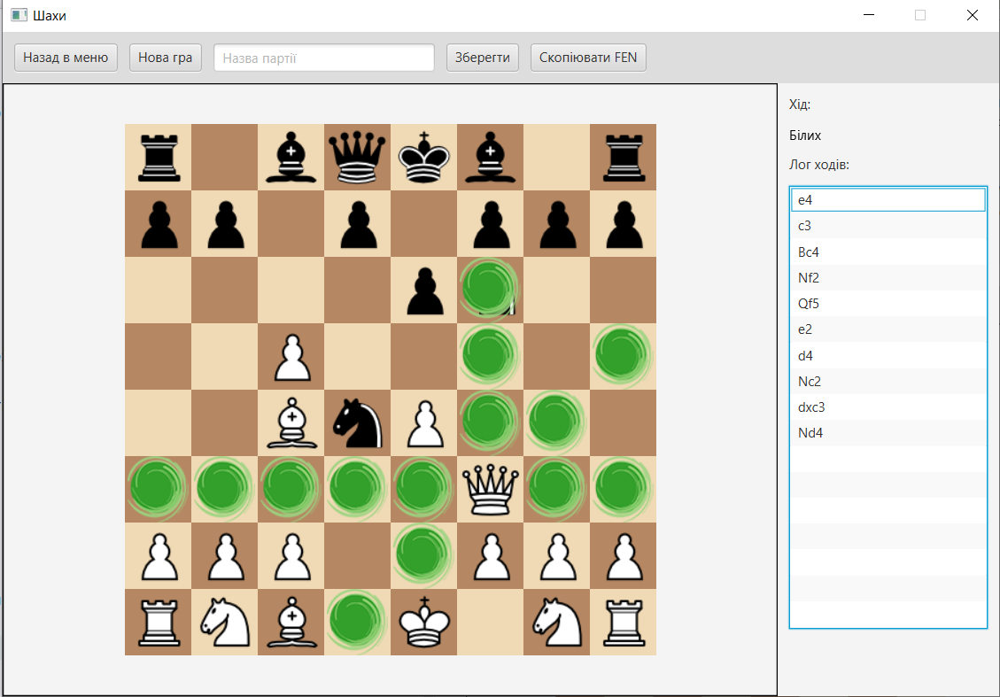
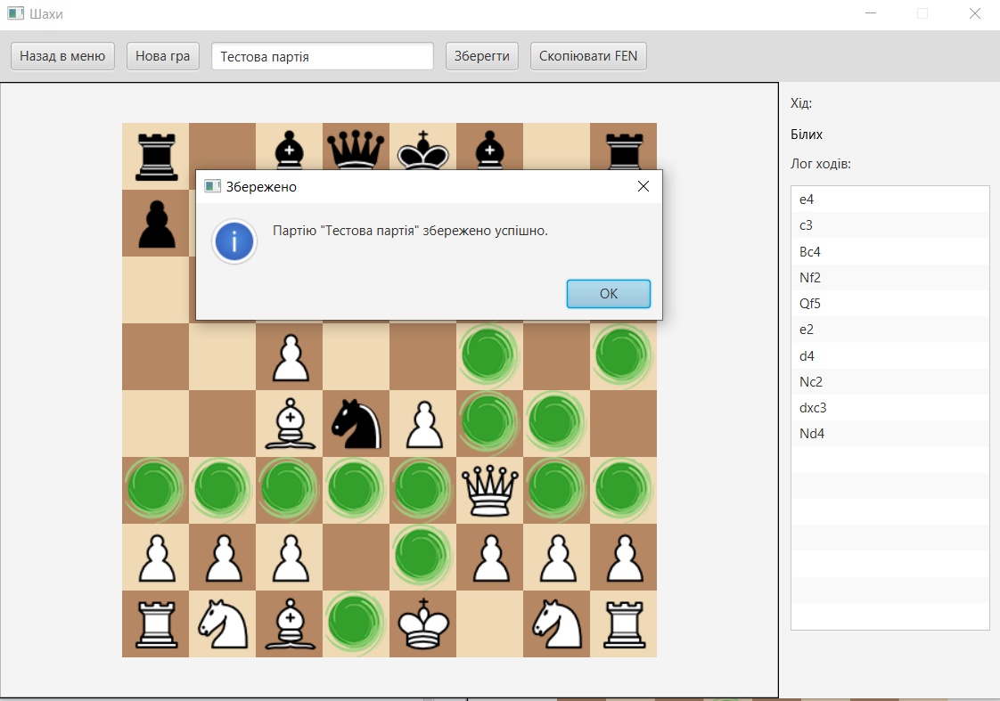
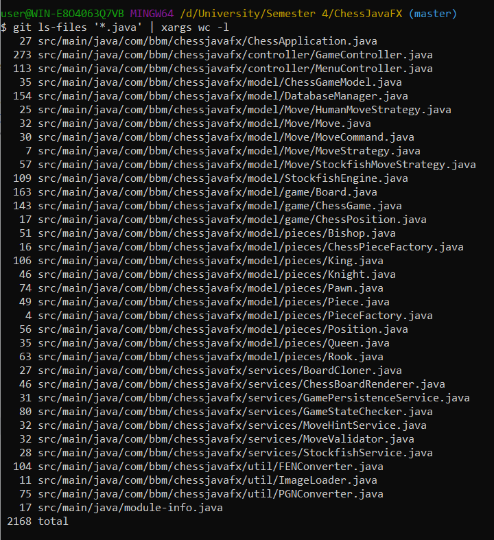

# Гра шахи

---

## Запуск

---

Для запуску гри склонуйте репозиторій та запустіть клас [ChessApplication.java](src/main/java/com/bbm/chessjavafx/ChessApplication.java) (для використання бота потрібно завантажити [Stockfish](https://stockfishchess.org/download/) та помістити посилання на його виконуваний файл в клас [StockfishService.java](src/main/java/com/bbm/chessjavafx/services/StockfishService.java)).

---

## Функціональність

---

### Головне меню

Кнопки для виходу, перегляду збережених ігор та початку гри (якщо раніше ігри відбувались - відкриється остання гра, якщо ні - створиться нова)

Список збережених ігор з можливістю їхнього запуску та видалення

---

### Дошка

Зверху розміщені кнопки для повернення в мню, створення нової гри, збереження партії та копіювання FEN- нотації партії (для початкового розміщення фігур: rnbqkbnr/pppppppp/8/8/8/8/PPPPPPPP/RNBQKBNR w KQkq - 0 1).

Справа знаходиться вибір типу гри (гравець проти гравця за одним комп'ютером, про бота та гра двох ботів), вибір складності бота (від 1 до 20) та тип розміщення фігур (всі фігури, без фігур, без пішаків, нові можна додавати в [ChessPosition.java](src/main/java/com/bbm/chessjavafx/model/game/ChessPosition.java))

Після початку гри справа з'являється лог ходів.

Партію можна легко зберегти. В локальній базі даних зберігається числовий ідентифікатор, назва, FEN та PGN нотації партії.

---

## Programming Principles

| Принцип                                   | Опис                                                                                                                                                                                                                          |
|-------------------------------------------|-------------------------------------------------------------------------------------------------------------------------------------------------------------------------------------------------------------------------------|
| **SRP (Single Responsibility Principle)** | `ChessGame` відповідає лише за менеджмент партії. `Board` — лише за стан поля. `GameStateChecker`, `MoveValidator`, `BoardCloner` — кожен за свою чітку частину логіки.  Кожен клас має лише одну причину для зміни. |
| **OCP (Open/Closed Principle)**           | Додати новий тип гравця або логіку визначення стану гри можна без зміни існуючих класів — лише через нові реалізації.                                                                                                         |
| **LSP (Liskov Substitution Principle)**   | `MoveStrategy`, `HumanMoveStrategy`, `BotMoveStrategy` — всі можуть підставлятися замість базового типу.                                                                                                                      |
| **DIP (Dependency Inversion Principle)**  | `ChessGame` залежить від абстракцій (`MoveStrategy`), а не від конкретних реалізацій.                                                                                                                                         |
| **DRY (Don’t Repeat Yourself)**           | Повторюваний код перевірки на шах/мат винесено у сервіси. Перевірка валідності ходу централізовано реалізована в `MoveValidator`.                                                                                          |
| **KISS (Keep It Simple, Stupid)**         | Класи створювались максимально простими.  Кожен клас відповідає за одну логіку — код легше тестувати й супроводжувати.                                                                                                     |
| **YAGNI (You Aren’t Gonna Need It)**      | Не реалізовано зайвого функціоналу.                                                                                                                                                                                           |

## Refactoring Techniques

| Техніка рефакторингу | Як застосовано                                                                                                                                                                                                         | Навіщо |
|----------------------|------------------------------------------------------------------------------------------------------------------------------------------------------------------------------------------------------------------------|--------|
| **1. Extract Class (Виділення класу)** | Логіка винесена в окремі класи: – перевірка шаху/мату/пату → `GameStateChecker` – валідація ходів → `MoveValidator` – клонування дошки → `BoardCloner` – підрахунок легальних ходів → `LegalMoveGenerator` | Щоб уникнути концентрації відповідальностей у `Board`, зменшити його розмір і зробити логіку модульною. |
| **2. Move Method (Переміщення методу)** | Методи `isCheckmate`, `hasAnyValidMove`, `isKingInCheck` переміщено з `Board` до `GameStateChecker`                                                                                                                    | Щоб методи були в класах, які відповідають за цю логіку (відповідно до SRP). |
| **3. Extract Interface (Виділення інтерфейсу)** | `MoveStrategy` реалізовано як інтерфейс для `HumanMoveStrategy` та `BotMoveStrategy`                                                                                                                                   | Для підтримки інверсії залежностей (D з SOLID), можливості легко підмінювати реалізації. |
| **4. Encapsulate Field (Інкапсуляція поля)** | Замість прямого доступу — використання `getGameStateChecker()`                                                                                                                                                         | Для збереження інкапсуляції внутрішнього стану. |
| **5. Replace Conditional with Polymorphism (Заміна умов поліморфізмом)** | Вибір між людиною й ботом реалізується через `MoveStrategy` з власною реалізацією `decideMove()`                                                                                                                       | Для уникнення умов і дотримання принципів ООП. |
| **6. Extract Method (Виділення методу)** | Методи `processMove`, `waitForHumanMove`, `startAsync` виділено в окремі методи з чіткими назвами                                                                                                                      | Для підвищення читабельності та спрощення логіки. |

## Design Patterns

| Патерн проєктування | Як застосовано                                                                                                                                                                                                                                                        | Призначення                                                                                          |
|---------------------|-----------------------------------------------------------------------------------------------------------------------------------------------------------------------------------------------------------------------------------------------------------------------|------------------------------------------------------------------------------------------------------|
| **MVC (Model-View-Controller)** | <ul><li>**Model** — `Board`, `GameStateChecker`, `MoveValidator`, `Piece` тощо</li><li>**View** — JavaFX GUI, відображення дошки, фігур, підсвітки</li><li>**Controller** — `GameController`, `MenuController` що керує ходами, обробкою кліків, станом гри</li></ul> | Відокремлення логіки гри від графічного інтерфейсу, полегшення тестування та підтримки               |
| **Factory Method (Фабричний метод)** | Створення фігур [ChessPieceFactory.java](src/main/java/com/bbm/chessjavafx/model/pieces/ChessPieceFactory.java)                                                                                                                                                                                                                                                      | Інкапсуляція логіки створення фігур, спрощення розширення (нові типи фігур)                          |
| **Strategy (Стратегія)** | Інтерфейс `MoveStrategy` з реалізаціями `HumanMoveStrategy` і `BotMoveStrategy`                                                                                                                                                                                       | Дозволяє замінювати поведінку ходу гравця без зміни основної логіки                                  |
| **Prototype (Прототип)** | Метод `clone()` у класах `Piece` або `Board` для створення копій без повторного створення вручну                                                                                                                                                                      | Застосовується при симуляціях (наприклад, для перевірки шаху після ходу) та при клонуванні стану гри |

---

## Кількість рядків коду

